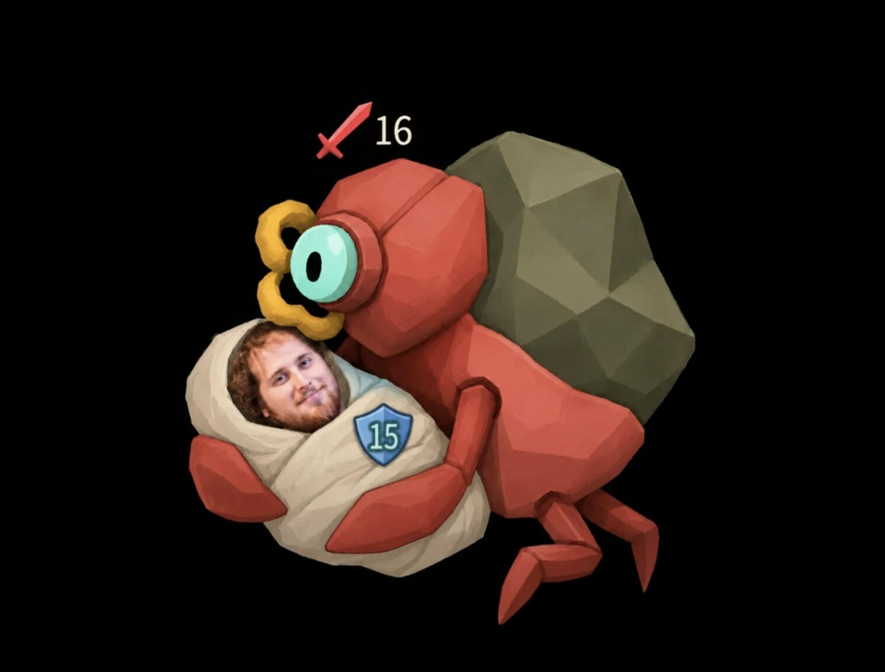
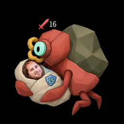

# 东尼意思 / Dongni Meaning

《杀戮尖塔 2》(Slay the Spire 2) 模组：新增一个事件 **东尼意思**（1-3 层问号房间随机出现）以及配套卡牌。

A Slay the Spire 2 content mod that adds the **Dongni Meaning** event (random unknown rooms in acts 1-3) and its cards.

> 注意：本 mod 完全由 codeX 制作，100% 纯 AI 无人工。
> Note: this mod was made entirely by Codex — 100% AI, no human labor.

## 预览 / Preview


| 东尼防御 | 东尼打击 | 东尼的诅咒 |
|---|---|---|
|  |  |  |

遗物：

## 事件：东尼意思 / The event

在 1-3 层的问号房间随机出现。一位自称安东尼·乔瓦内蒂的人找到了你，他听说你最近在玩小卡组，
准备警告你不准再玩小卡组，否则找人弄你。你该怎么办？

| 选项 | 效果 | 结果文本 |
|---|---|---|
| ① 接受提议 | 获得【东尼打击】【东尼防御】，为一张卡牌附魔【克隆】，获得遗物【宾邦】 | 东尼意思。 |
| ② 拒绝 | 失去 16 点生命，删除 3 张牌 | 你不顾安东尼，执意要删辣个，然后被安东尼找人弄了。 |
| ③ 一拳下去 | 获得【东尼圣遗物】和【东尼的诅咒】 | 你一拳打死了安东尼，但是总感觉它的阴魂不散... |

【克隆】是本体已有的附魔（该牌可在休息处被复制），【宾邦】即本体遗物 **Bing Bong**
（每当你将一张牌加入牌组，额外加入一张同样的牌）——与原版文本「宾梆」指的是同一个东西，所以本 mod 直接发放本体遗物。

> 火堆「克隆」修复：本体只在拥有 **PaelsGrowth**（远古遗物）时才在火堆提供克隆选项，光有【克隆】附魔是找不到地方的。
> 本 mod 打了补丁：只要你的局外牌组里存在带【克隆】附魔的牌，火堆就会出现与本体相同的克隆选项（按本体逻辑复制所有带克隆附魔的牌）。

## 卡牌 / The cards

| | 东尼防御 | 东尼打击 | 东尼的诅咒 |
|---|---|---|---|
| 颜色 | 无色 | 无色 | 诅咒 |
| 稀有度 | 罕见 / 蓝 | 罕见 / 蓝 | 诅咒 |
| 类型 | 能力 | 攻击 | 诅咒 |
| 费用 | 0 | 1 | 不能被打出 |
| 效果 | 在你的回合开始时获得 15 点格挡。你无法从卡牌中获得格挡。 | 造成 6 点伤害。你的牌组中每有一张牌，伤害增加 1 点。 | 不能被打出、**永恒**。当这张牌在你的手牌中时，你抽牌和获得能量的效果改为下回合生效。 |
| 升级 | 获得 **固有** | 基础伤害 6 → 8 | 不可升级 |

## 遗物：东尼圣遗物 / The relic

| | |
|---|---|
| 名称 | 东尼圣遗物 (Dongni's Sacred Relic) |
| 稀有度 | 事件 (Event) |
| 效果 | 每回合结束时，若你的格挡不超过 15，则在下回合获得 2 点能量并抽 2 张牌。 |
| 来源 | 「东尼意思」事件选项 ③ |

判定发生在你的回合结束时（此时格挡还是回合结束时的数值，下一回合开始才会被清除），
奖励用的是本体自带的「下回合获得能量」(`EnergyNextTurnPower`) 与「下回合抽牌」(`DrawCardsNextTurnPower`) 状态，
所以能力栏会显示这两个图标，结算交给游戏本体。

实现细节与本体保持一致：

- **东尼防御**：回合开始获得格挡发生在「格挡被清除之后」，因此不会立刻消失；这部分格挡是 `Unpowered`，不受脆弱/敏捷影响。「无法从卡牌中获得格挡」与本体能力 **不可格挡 (No Block)** 的判定完全相同（只有来自卡牌的格挡会被乘 0）。多次打出会叠加层数。
- **东尼打击**：按**局外牌组**数量计算（`player.Deck`，即你在跑图时拥有的整套牌），不随战斗中的抽牌/打出/消耗变化。战斗中那些牌其实是局外牌组的克隆，所以数值在整场战斗里保持不变。
- **东尼的诅咒**：拦截抽牌与获得能量的钩子（`ModifyHandDraw` / `ShouldDraw` / `ModifyEnergyGain`），然后**直接发放本体自带的「下回合抽 N 张牌」(`DrawCardsNextTurnPower`) 与「下回合获得 N 点能量」(`EnergyNextTurnPower`) 状态**——所以你会看到这两个图标挂在能力栏上，实际结算由本体在下一回合完成：能量在回合开始的能量重置之后到账，抽牌并入下一回合的抽牌数。多张诅咒不会重复计算或重复发放；回合开始的能量重置属于「重置」而非「获得能量」，因此不受影响。

## 依赖 / Requirements

- Slay the Spire 2 **0.111.0** 或更高
- [BaseLib](https://steamcommunity.com/sharedfiles/filedetails/?id=3737335127) 3.4.7 或更高（创意工坊订阅）

## 安装 / Installation

把编译产物目录 `DongniDefense/`（包含 `DongniDefense.dll`、`DongniDefense.pck`、`DongniDefense.json`）
放进游戏目录的 `mods/` 文件夹：

```
Slay the Spire 2/
└── mods/
    └── DongniDefense/
        ├── DongniDefense.dll
        ├── DongniDefense.json
        └── DongniDefense.pck
```

然后在游戏内「设置 → 模组设置」里启用本模组。

## 从源码构建 / Building from source

需要 .NET SDK 9、[MegaDot 或 Godot 4.5.1 .NET 版](https://github.com/Alchyr/ModTemplate-StS2/wiki/Setup)。

1. 把 `Directory.Build.props.example` 复制成 `Directory.Build.props`，并把 `GodotPath` 改成你的 Godot/MegaDot 可执行文件路径
   （该文件里有本机路径，所以不进版本库）。
2. 只改代码：`dotnet build`（会把 dll 复制到 `mods/`）。
3. 改了文案/图片：先 `dotnet publish`（会调用 Godot `--export-pack` 生成 `.pck` 并复制过去）。
   首次构建前建议先执行一次 `godot --headless --import` 生成导入缓存。

卡面来自你提供的素材（`Desktop/teste/dnys`），由 `python tools/prepare_supplied_art.py` 裁切/适配成游戏要求的尺寸
（卡面 1000x760 与 250x190、事件插画 3440x1613，并去掉了素材右下角的水印带）。
东尼防御的卡面与能力图标是 `python tools/make_card_art.py` 生成的占位图，可直接替换 `DongniDefense/images/` 下的 PNG。

## 打包发布 / Packaging a release

`dotnet publish` 之后，运行下面的脚本会把发布包（`DongniDefense.dll` + `.pck` + `.json`）压缩到 `dist/`，
可直接拖到 GitHub Releases 里：

```powershell
powershell -ExecutionPolicy Bypass -File tools/package_release.ps1
# 游戏不在默认路径时：
# powershell -ExecutionPolicy Bypass -File tools/package_release.ps1 -ModsDir "…\Slay the Spire 2\mods\DongniDefense"
```

## 素材与版权 / Assets

- 代码：MIT（见 `LICENSE`）。
- 图片：来自 mod 作者提供的素材（聊天梗图截图 + AI 生成图，`art_source/` 保留了原始文件），
  不在 MIT 许可范围内；如要公开分发请自行确认素材来源与授权。

## 文件结构 / Layout

```
DongniDefenseCode/
├── MainFile.cs                          模组入口（Harmony 初始化 + 构建自检日志）
├── Cards/DongniDefense.cs               东尼防御
├── Cards/DongniStrike.cs                东尼打击
├── Cards/DongniCurse.cs                 东尼的诅咒（拦截抽牌/能量并转为下回合状态）
├── Cards/DongniDefenseCardBase.cs       卡牌基类（卡图路径）
├── Events/DongniMeaning.cs              东尼意思事件
├── Patches/DongniCurseDrawPatch.cs      记录被诅咒拦截的抽牌数量
├── Patches/CloneRestSitePatch.cs        让带【克隆】附魔的牌能在火堆被复制
├── Powers/DongniDefensePower.cs         能力：回合开始给格挡 + 禁止卡牌来源的格挡
├── Powers/DongniDefensePowerBase.cs     能力基类（图标路径）
├── Relics/DongniSacredRelic.cs          东尼圣遗物
└── Relics/DongniDefenseRelicBase.cs     遗物基类（图标路径）
DongniDefense/
├── images/                              卡图、能力图标、遗物图标、事件插画
└── localization/{eng,zhs}/              卡牌 / 能力 / 遗物 / 事件文案
```

游戏内 id：`DONGNIDEFENSE-DONGNI_DEFENSE`、`DONGNIDEFENSE-DONGNI_STRIKE`、`DONGNIDEFENSE-DONGNI_CURSE`（卡牌），
`DONGNIDEFENSE-DONGNI_DEFENSE_POWER`（能力）、`DONGNIDEFENSE-DONGNI_MEANING`（事件）、
`DONGNIDEFENSE-DONGNI_SACRED_RELIC`（遗物）。

模组内部 id 仍是 `DongniDefense`（显示名已改为「东尼意思」）；如需连 id 一起改名可以再调整。

## 更新日志 / Changelog

### v1.2.0

- 新增遗物【东尼圣遗物】：每回合结束时若格挡 ≤ 15，下回合 +2 能量并抽 2 张牌；由事件选项 ③ 与【东尼的诅咒】一起发放。
- 【东尼的诅咒】新增关键词 **永恒**（无法从牌组中移除或变化）。
- 修复：选择事件选项 ① 给卡牌附魔【克隆】后，火堆没有克隆选项可用（本体只因 PaelsGrowth 提供该选项）。

### v1.1.0

- 新增事件「东尼意思」（1-3 层问号房间）与卡牌【东尼打击】【东尼的诅咒】。
- 【东尼的诅咒】改为直接发放本体的「下回合抽牌 / 下回合能量」状态。
- 【东尼打击】改为按局外牌组数量加伤。

### v1.0.0

- 新增卡牌【东尼防御】。
